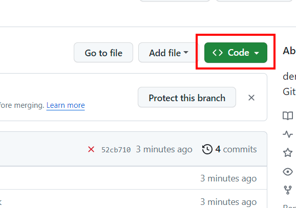
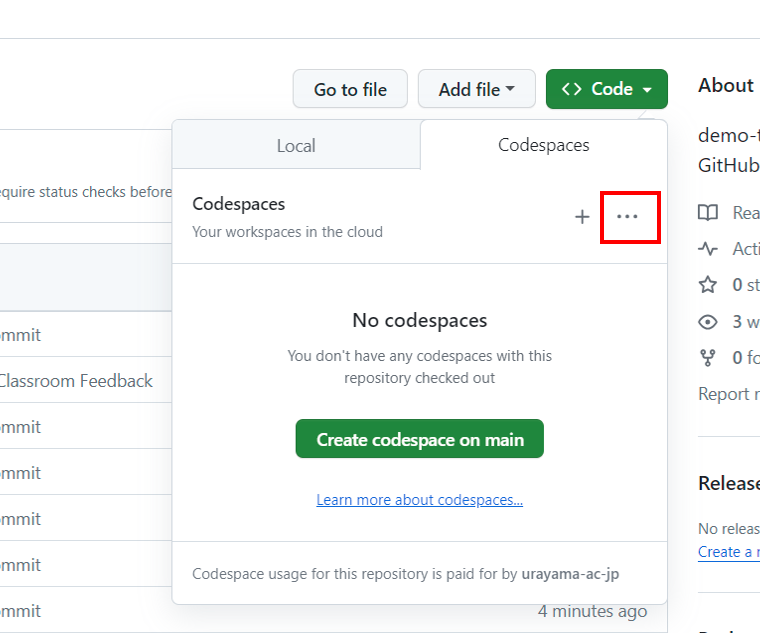
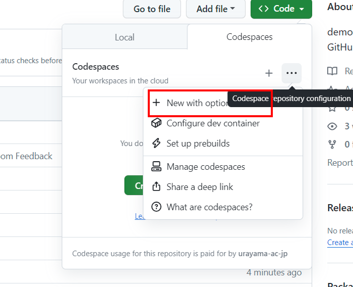
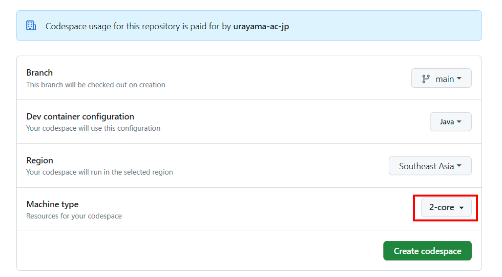
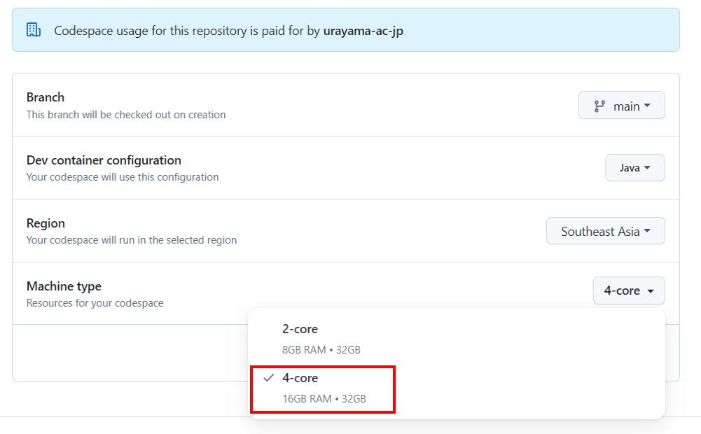
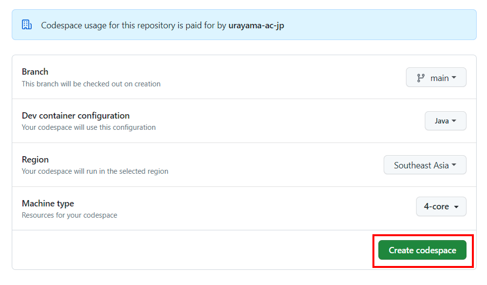
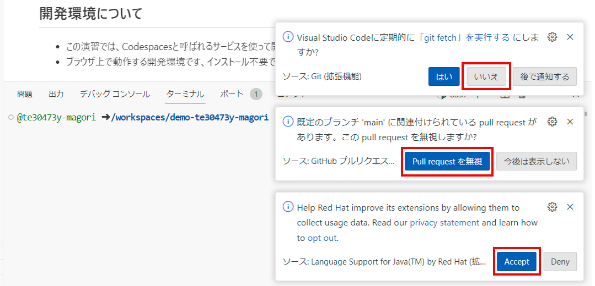
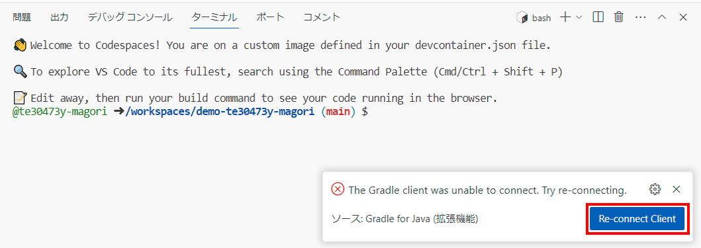
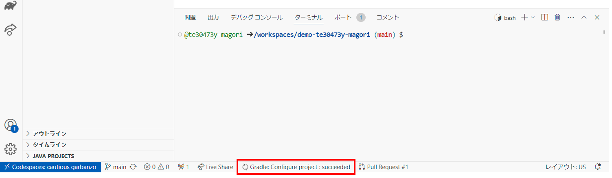
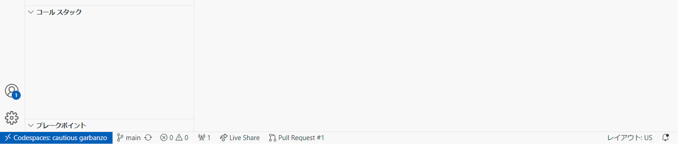

# Codespacesの実行手順
1. Codeをクリックします。 
1. 赤枠の`・・・`をクリックします。 
1. `New with option`をクリックします。 
1. 赤枠をクリックします。 
1. 赤枠の`4-core`をクリックします。 
4. `Create codespace`をクリックします。 

5. しばらく待ちます。 

6. 画像のダイアログが表示されたら、赤枠のボタンを押してください。（出力されない場合もありますので、出た場合は対応してください）
    
    

8. 画面下に赤枠が表示されている場合、環境構築中なのでしばらくお待ちください。 
9. 上記で表示されていた赤枠部分が消えていることを確認してください。 

7. 虫と再生ボタンのアイコンを押します。 

8. `Launch AssignmentApplication`が選択されていることを確認し再生ボタンを押します。 初回はダイアログが表示されます、YESを選択してください。 

9. `Open in Browser`を押します。(表示されるまでしばらく時間が掛かります。) 

10. Webページが表示されます。 
